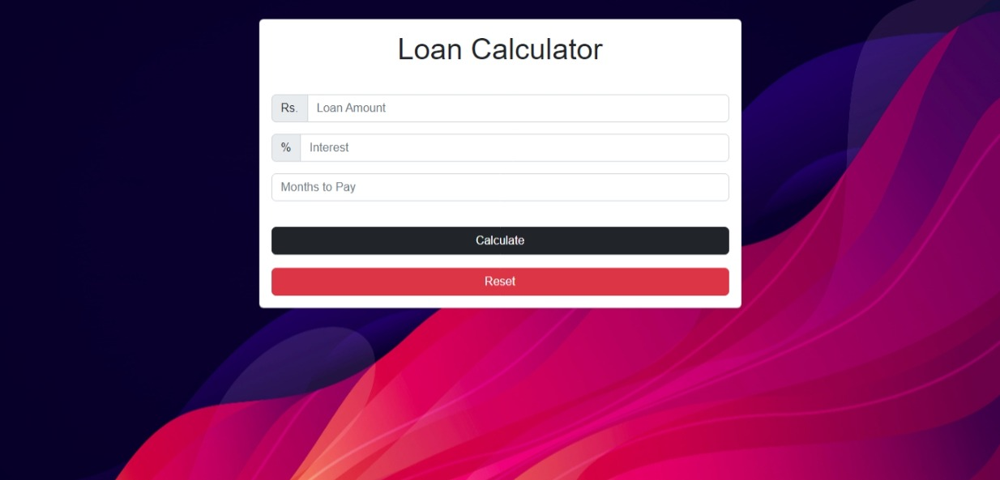
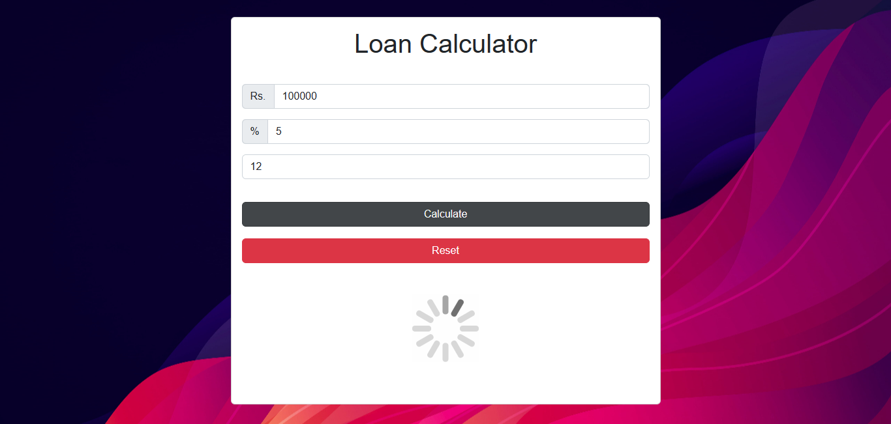
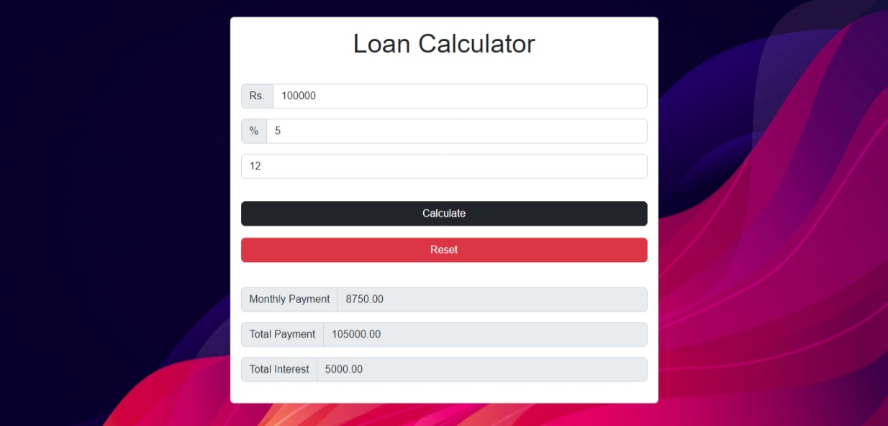
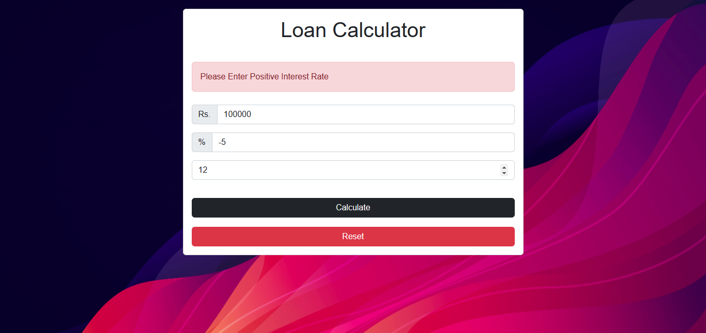
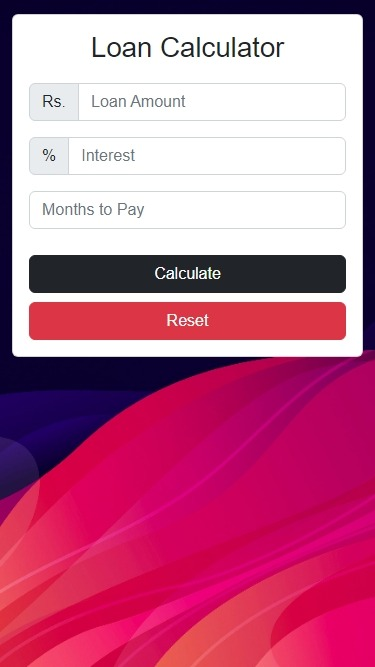
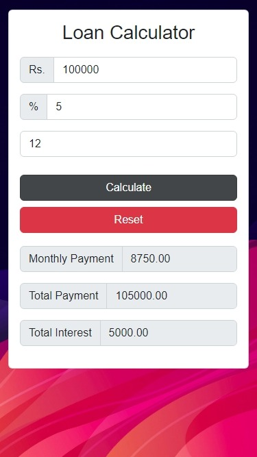

# Loan Calculator - HTML, CSS , Bootstrap & Javascript

This is a loan calculator built with HTML, CSS,Bootstrap & JavaScript. In this simple expenses tracker application project I have used  some of the more intermediate advanced parts of the document object model or the javascript dom to show  how to build this web application. 

## Features

- Users can enter a loan amount, interest rate, and months to repay
- Loading animation displays upon submission
- Calculates and displays the results for monthly - payment, total payment, and total interest
- An error message displays if the input is invalid

## Technologies

Built with:

- HTML
- CSS
- Bootstrap
- JavaScript

## Screenshots

### Desktop View

### Mobile View
 

